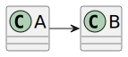

# US 1001

*This is an example template*

## 1. Context

*Explain the context for this task. It is the first time the task is assigned to be developed or this tasks was incomplete in a previous sprint and is to be completed in this sprint? Are we fixing some bug?*

## 2. Requirements

*In this section you should present the functionality that is being developed, how do you understand it, as well as possible correlations to other requirements (i.e., dependencies). You should also add acceptance criteria.*

*Example*

**US G002** As {Ator} I Want...

**Acceptance Criteria:**

- G002.1. The system should...Blá Blá Blá ...

- G002.2. Blá Blá Blá ...

**Dependencies/References:**

*Regarding this requirement we understand that it relates to...*

## 3. Analysis

*In this section, the team should report the study/analysis/comparison that was done in order to take the best design decisions for the requirement. This section should also include supporting diagrams/artifacts (such as domain model; use case diagrams, etc.),*

## 4. Design

*In this sections, the team should present the solution design that was adopted to solve the requirement. This should include, at least, a diagram of the realization of the functionality (e.g., sequence diagram), a class diagram (presenting the classes that support the functionality), the identification and rational behind the applied design patterns and the specification of the main tests used to validade the functionality.*

### 4.1. Realization

### 4.2. Class Diagram



### 4.3. Applied Patterns

### 4.4. Tests

Include here the main tests used to validate the functionality. Focus on how they relate to the acceptance criteria.

**Test 1:** *Verifies that it is not possible to ...*

**Refers to Acceptance Criteria:** G002.1


```
@Test(expected = IllegalArgumentException.class)
public void ensureXxxxYyyy() {
	...
}
````

## 5. Implementation

*In this section the team should present, if necessary, some evidencies that the implementation is according to the design. It should also describe and explain other important artifacts necessary to fully understand the implementation like, for instance, configuration files.*

*It is also a best practice to include a listing (with a brief summary) of the major commits regarding this requirement.*

## 6. Integration/Demonstration

*In this section the team should describe the efforts realized in order to integrate this functionality with the other parts/components of the system*

*It is also important to explain any scripts or instructions required to execute an demonstrate this functionality*

## 7. Observations

*This section should be used to include any content that does not fit any of the previous sections.*

*The team should present here, for instance, a critical prespective on the developed work including the analysis of alternative solutioons or related works*

*The team should include in this section statements/references regarding third party works that were used in the development this work.*


# US G001 - `Follow the technical constraints and concerns of the project

`
## 1. Requirements Engineering

### 1.1. auth.domain.User Story Description

As Project Manager, I want the team to follow the technical constraints and concerns of the project

### 1.2. Customer Specifications and Clarifications

**From the specifications document:**

>	Each skill is characterized by having a unique designation
>
>

**From the client clarifications:**

> **question.Question:** Sobre a US "G001", com a informação:
"G001 As Project Manager, I want the team to follow the technical constraints and concerns of the project
– Priority: 1
– References: These constraints and concerns are described in Section 3.
"
Assumimos que podemos fazer o ficheiro "supplementary-specification.md" que é o FURPS (The FURPS+ System for Classifying Requirements).
Estamos corretos? Caso o pretendido seja distinto, queiram p.f indicar.
>
> **Answer:** As US que iniciam com a letra "G" devem ser consideradas "preocupações" globais durante todo o projeto. A maioria delas está no sprint A.
Em particular estão descritos esses "concerns" na secção 3.2. Alguns que têm requisitos técnicos especiais de algumas UCs aplicam-se em particular a algumas US (estão assinaladas). Outros NFR aplicam-se genericamente a todo o projeto pois são preocupações globais.
Deve haver o cuidado de comprovar evidências dessa "preocupação" ao longo de todo o projeto. Como são preocupações gerais (i.e., "crosscutting") as evidências podem aparecer no contexto de diversas US (depende de fazerem ou não sentido em cada US e que trabalham).
Relativamente a este sprint, e para LAPR4, parece-me razoável que remetam para uma secção como a que indicou alguma documentação sobre estes NFR e como vão abordar cada um.

### 1.3. Acceptance Criteria

* **AC1:** NFR01 - Programming language The solution should be implemented using Java as the main language. Other languages can be used in accordance with more specific requirements.
* **AC2:** NFR02 - Technical Documentation Project documentation should be always available on the project repository ("docs" folder, markdown format) and, when applicable, in accordance to the UML notation. The development process of every US (e.g.: analysis, design, testing, etc.) must be reported (as part of the documentation).
* **AC3:** NFR03 -Test-driven development The team should develop a relevant set of automated tests for every US / Class / Method. The team should aim to adopt a test-driven development approach.
* **AC4:** • NFR03 - Test-driven development The team should develop a relevant set of automated tests for every US / Class / Method. The team should aim to adopt a test-driven development approach.
* **AC5:** • NFR04 - Source Control The source code of the solution as well as all the documentation and related artifacts should be versioned in a GitHub repository to be provided to the students. Only the main (master/main) branch will be used (e.g., as a source for releases)
* **AC6:** • NFR05 - Continuous Integration The Github repository will provide night builds with publishing of results and metrics.
* **AC7:** • NFR06 - Deployment and Scripts The repository should include the necessary scripts to build and deploy the solution in a variety of systems (at least Linux and Windows). It should also include a readme.md le in the root folder explaining how to build, deploy and execute the solution.
* **AC8:** • NFR07 - Database By configuration, the system must support that data persistence is done either "in memory" or in a relational database (RDB). Although in-memory 15 3 Requirement database solutions can be used during development and testing, the solution must include a nal deployment where a persistent relational database is used. The system should have the ability to initialize some default data.
* **AC9:** • NFR08 - Authentication and Authorization The system must support and apply authentication and authorization for all its users and functionalities.

### 1.4. Found out Dependencies


### 1.5 Input and Output Data

N/A
### 1.6. System Sequence Diagram (SSD)

**_Other alternatives might exist._**

#### Alternative One


### 1.7 Other Relevant Remarks
