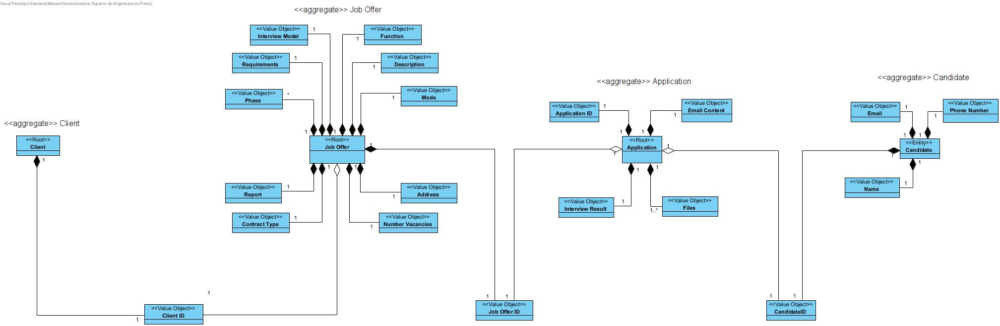

# Global Artifacts

This folder contains all the global artifacts of the project, split by each implementation phase.

## SUPPLEMENTARY SPECIFICATION

[Supplementary Specification](supplementary-specification.md)

## DOMAIN MODEL

[DOMAIN MODEL](Domain_Model/lapr4-ip-domain-model-ddd.jpg)

## USE CASES

[USE CASES](UCD/uc.md)