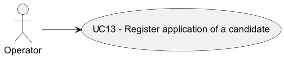
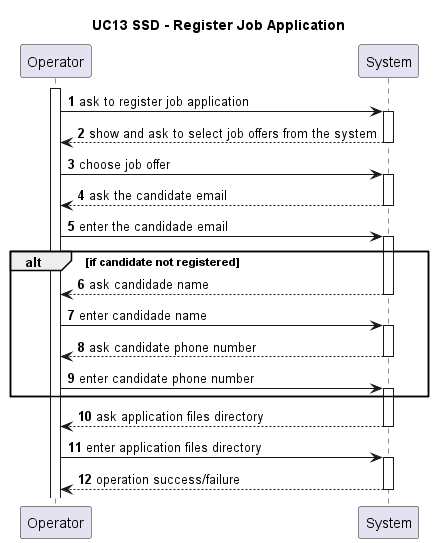
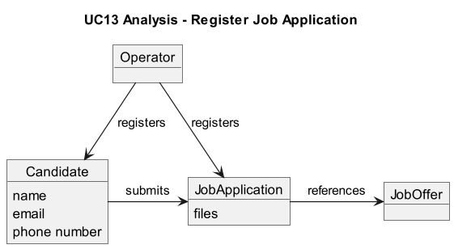
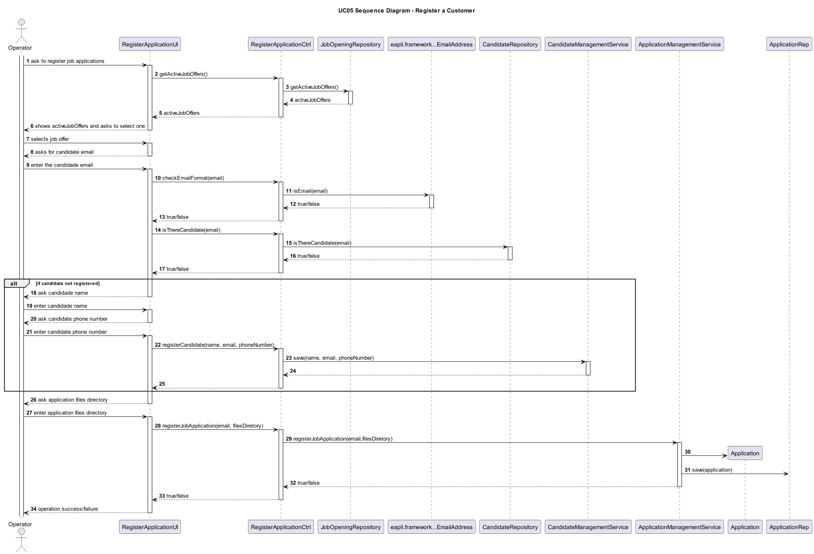
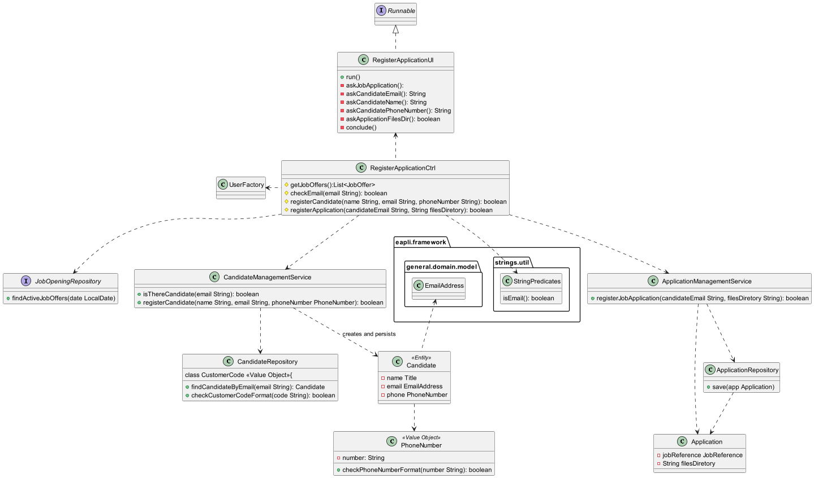

# UC13 - REGISTER A JOB APPLICATION

## 1. Requirements Engineering ##

### Use Case Description ###

---

### Acceptence Acceptance Criteria ###

- **AC01** - if a candidate is not registered in the system yet, it must be automatically created
- **AC02** - email address and phone numbers must be in a valid format

---

### Input and Output Data ###

- job offer
- candidate email
- candidate name
- candidate phone number

---

### System Sequence Diagram (SSD) ###

---

## 2. Analysis

---

## 3. Design

### Sequence Diagram (SD) ###

---

### Class Diagram ###

