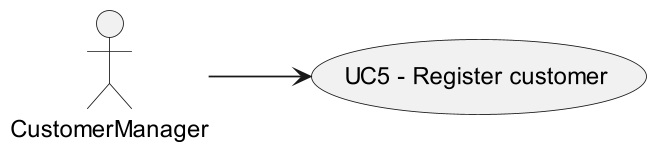

# US 1001

## 1. Requirements

**US 1001** As Customer Manager I want to register a customer and that the system automatically creates a user for t hat customer

**References** - Alternatively this can be achieved by a bootstrap process

---

## 2. Use Case Diagram 

---

## 3. Affected Use Cases

| USE CASE |               DOCUMENT               |
|:--------:|:------------------------------------:|
|   UC05   | [README.md](../../uc/uc05/README.md) |

## 4. US Implementation

- [Customer.java](../../../../jobs4u.backoffice/src/main/java/customer/domain/Customer.java)
- [CustomerCode.java](../../../../jobs4u.backoffice/src/main/java/customer/domain/CustomerCode.java)
- [CustomerRep.java](../../../../jobs4u.backoffice/src/main/java/customer/persistence/CustomerRep.java)
- [CustomerManagementService.java](../../../../jobs4u.backoffice/src/main/java/customer/use_cases/CustomerManagementService.java)
- [RegisterCustomerCtrl.java](../../../../jobs4u.backoffice/src/main/java/customer/use_cases/register_customer/RegisterCustomerCtrl.java)
- [RegisterCustomerUI.java](../../../../jobs4u.backoffice/src/main/java/customer/use_cases/register_customer/RegisterCustomerUI.java)

### Unit Tests

- [CustomerCodeTest.java](../../../../jobs4u.backoffice/src/test/java/customer/domain/CustomerCodeTest.java)