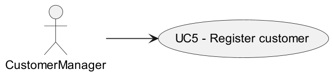
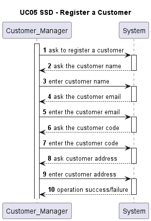
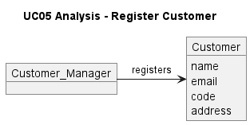
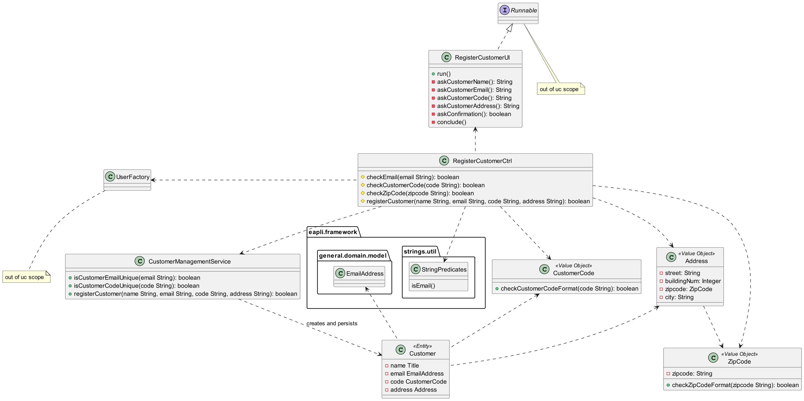

# UC05 - REGISTER A CUSTOMER

## 1. Requirements Engineering ##

### Use Case Description ###

### Client Specifications and Clarifications ###

> **Relativamente ao Job Opening (secção 2.2.2), o job reference refere que deve ser gerado pelo sistema a partir de um customer code. O que é este customer code e se existe alguma regra para a sua criação?**
>
> Qualquer customer terá de ter um código identificativo (único) que poderá ser uma espécie de abreviatura do seu nome, com um número limitado de caracteres. Por exemplo, para o cliente Instituto Superior de Engenharia do Porto, o customer code poderia ser ISEP e não poderia haver mais nenhum customer com este customer code. Um limite razoável seria talvez 8 a 10 carateres. Podemos definir 10. Este código é introduzido manualmente na criação do customer no sistema.

> **É correto assumir que o customer fica automaticamente atribuido ao customer manager que o registou?**
>
> Sim. No âmbito deste projeto vamos assumir que isso deve acontecer.

> **Relativamente ao formato do customer code, em todos os exemplos fornecidos, este é uma sigla/acrónimo com letras maiúsculas (ex: "ISEP", "IBM"). Só pode ter este formato ou pode conter números e letras minúsculas?**
>
> Sugere-se 10 caracteres no máximo. Penso que seria de manter apenas letras maiúsculas podendo ainda ter dígitos (0-9), mas começando sempre por letra.

---

### Acceptence Acceptance Criteria ###

- **AC01:** Cada customer deve ser registado no sistema com um nome, um email, um endereço e um customer code
- **AC02:** O customer code deve ser único no sistema e ter no máximo 10 caracteres, podendo admitir dígitos. Contudo, deve sempre começar por letras.
- **AC03:** Ao regitar um customer, o sistema deve automaticamente criar um user no sistema de autenticação para esse customer, gerando automaticamente uma password válida para esse user
- **AC04:** A password gerada deve conter 8 caracteres, e deve conter letras maiúsculas, minúsculas, dígitos, e caracteres especiais (um de cada, pelo menos)
- **AC05:** O email deve estar num formato válido e ser único

---

### Dependencies ###

> **G007 - As a Project Manager, I want the system to support and apply authentication and authorization for all its users and functionalities.**
> 
> Esta funcionalidade é necessária para permitir a criação e persistência dum user associado ao customer registado

---

### Input and Output Data ###

**Typed Data**: 

- Customer name
- Customer email
- Customer code
- Customer address

**Output Data**:
    
- sucesso ou insucesso da operação

---

### System Sequence Diagram (SSD) ###

---

## 2. Analysis

### Classes identified ###

 - Customer Manager
 - Customer

---

## 3. Design

### Sequence Diagram (SD) ###

---

### Class Diagram ###

## 4. Acceptance Tests

### Unit Tests

> **Class CustomerCode**
>- testCorrectCodeFormat()
>- testIncorrectCodeFormat()

> **Class Zipcode**
>- testCorrectFormatZipcode()
>- testIncorrectFormatZipcode()

### Runtime Tests

- check that the actor cannot indicate an email already registered in the system for another customer
- check that the actor cannot indicate a customer code already registered in the system for another customer
- check that the customer is registered in the database