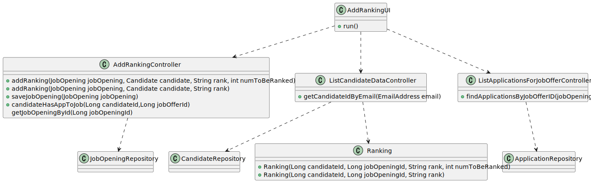
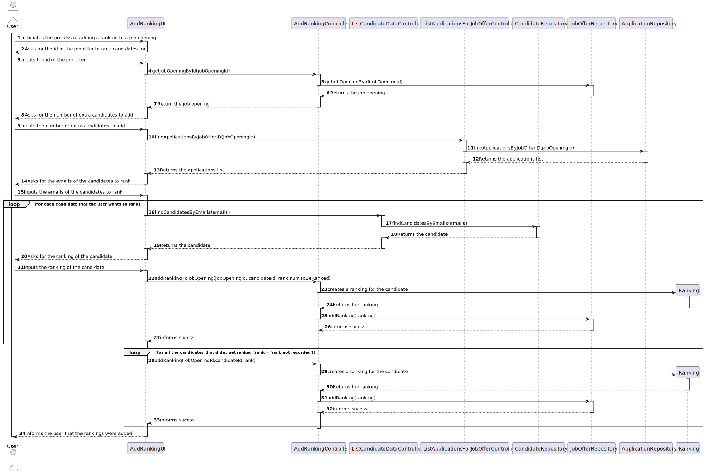

# UC24 #

## 1.Requirements Engineering ##

     This section describes the requirements of the use case.

### Use Case Description ###

     UC16: As Customer Manager, I want to rank the candidates for a job opening.

### Input and Output Data ###

**Typed Data**:
-Rankings

**Selected Data**:
* job Offer

**Output Data**:

    * Ranking Table
    * Operation Success

---

## 2.Analysis

### Classes identified ###

- AddRankingController
- AddRankingUI
- JobOpeningRepository
- JobOpening
---

### Class Diagram ###

---

## 3.Design

### Sequence Diagram (SD) ###

---

