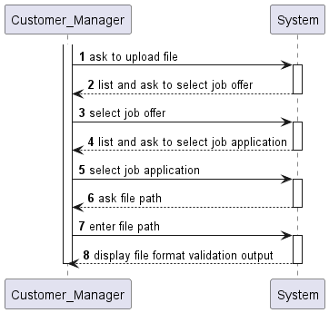
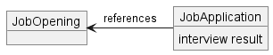

# UC23 - Upload a text file with the candidates answers for an interview

## Use Case Diagram

---

## Client Specifications and Clarifications

None

---

## System Sequence Diagram (SSD)

---

## Acceptance Criteria

- **AC01** - The file must pass the syntactic validation provided by the interview model plugin
- **AC02** - The file must be stored in the database and associated to the correct job application
- **AC03** - The shown job openings must be in interview phase

---

## Dependencies

> **US 2002** - As Operator, I want to register an application of a candidate for a job opening and import all files received
> 
> The application must registered

> **US 1011** - As Customer Manager, I want to select the interview model to use for the interviews of a job opening (for their evaluation/grading).
> 
> The interview model for the job offer must be set, to be used for the file syntactic validation

---

## Input and Output Data

### Input Data

#### Selected data

- job offer
- job application

#### Typed data

- answers file path

---

## Domain Analysis

