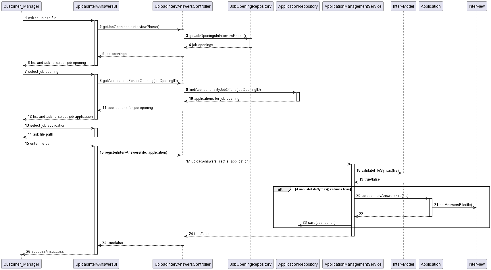
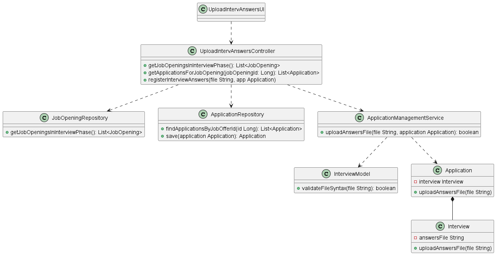

# US 1017

**US 1017** - As Customer Manager, I want to upload a text file with the candidate responses for an interview

## AFFECTED USE CASES

| USE CASE |               DOCUMENT               |
|:--------:|:------------------------------------:|
|   UC23   | [README.md](../../uc/uc23/README.md) |

---

## REQUIREMENTS AND ANALYSIS

US corresponds directly to **UC23** requirements and analysis, so refer to **UC23** documentation for more information.

---

## DESIGN

### UC23 SEQUENCE DIAGRAM

### CLASS DIAGRAM

---

## TESTS

### UNIT TESTS

_Not applicable_

### RUNTIME TESTS

- Run UC23 and check if the update is made in the interview answer file attribute of the chosen application

---

## IMPLEMENTATION

- [UploadInterviewAnswersUI.java](../../../../jobs4u.backoffice/src/main/java/application/use_cases/upload_interv_answers/UploadInterviewAnswersUI.java)
- [UploadInterviewAnswersController.java](../../../../jobs4u.backoffice/src/main/java/application/use_cases/upload_interv_answers/UploadInterviewAnswersController.java)
- [JobOpeningRepository.java](../../../../jobs4u.backoffice/src/main/java/jobOpening/JobOpeningRepository.java)
- [ApplicationRepository.java](../../../../jobs4u.backoffice/src/main/java/application/ApplicationRepository.java)
- [ApplicationManagementService.java](../../../../jobs4u.backoffice/src/main/java/application/ApplicationManagementService.java)
- [IntervModel.java](../../../../jobs4u.utils/src/main/java/requirem_specs/IntervModel.java)
- [Application.java](../../../../jobs4u.backoffice/src/main/java/application/domain/Application.java)
- [Interview.java](../../../../jobs4u.backoffice/src/main/java/application/domain/Interview.java)

