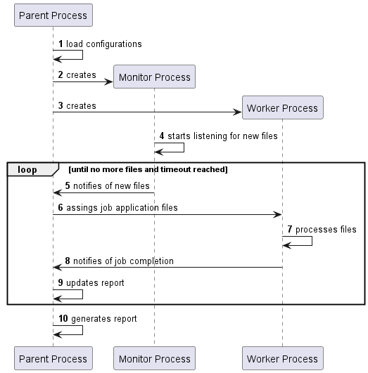
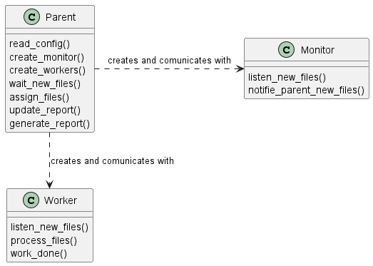

# US 2001b

## 1. REQUIREMENTS

>**US 2001b** - As Product Owner, I want the system to, continuously, process the files produced by the Applications Email Bot, so that they can be imported into the system by initiative of the Operator
>
>**References** - See NFR13(SCOMP)

>**NFR13(SCOMP)** - An alternative solution for the upload of files must be implemented following specific technical requirements such as the use of the C programming language with shared memory and semaphores. Specific requirements will be provided in SCOMP.

### Must be implemented using:

- C programming language
- processes
- shared memory
- semaphore primitives
- no busy waiting

>### Monitor Process:
>
>A child process should be created to periodically monitor an input directory for new files related to the 'Application' phase of the recruitment process. If new files are detected, a notification (using a semaphore) should be sent to the parent process.

>### Input and Output Directories:
>
>The Bot should copy the files to a shared folder. This shared folder should be organized by job reference (top folders) and then by application (subfolder inside the job reference folder).

>### Parent Process
>
>Upon receiving the notification, the parent process should distribute the new files among a fixed number of worker child processes. Each child process will be responsible for copying all files related to a specific candidate to its designated subdirectory in the output directory.
>
>Once a child has finished copying all files for a candidate, it should inform its parent that it is ready to perform additional work. Child workers do not terminate.
>
>Once all files for all candidates have been copied, the parent process should generate a report file in the output directory. This report should list, for each candidate, the name of the output subdirectory and the names of all files that were copied.

>### File Bot Configuration:
>
>The names of the input and output directories, the number of worker children, the time interval for periodic checking of new files, etc., should be configurable. This configuration can be achieved either through input parameters provided when running the application or by reading from a configuration file.

---

## 2. AFFECTED USE CASES

| USE CASE |               DOCUMENT               |
|:--------:|:------------------------------------:|
|   UC13   | [README.md](../../uc/uc13/README.md) |

---

## 3. ACCEPTANCE TESTS

- [x] check if configuration data is well loaded
- [x] check if the monitor process is created
- [x] check if workers processes are created in the correct quantity
- [x] check if the monitor process detects new files and notify the parent process
- [x] check if parent receives notification of new files and assigns application to worker process
- [x] check if worker process copies files to the correct subdirectory and notifes parent of job done
- [ ] check if the report file is well generated at the end of the program

---

## 4. DESIGN

### SEQUENCE OF EVENTS

### MODULES

---

## 5. US Implementation

[applications-files-bot](../../../../scomp/applications-files-bot)

### Unit Tests

- to do